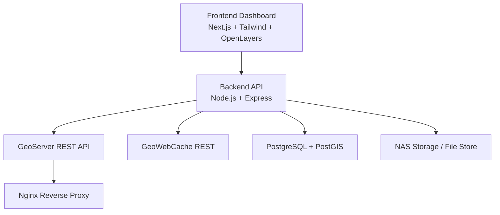

# Fitur & Tech Stack

## Dashboard GeoServer Services

Dashboard GeoServer Services adalah antarmuka terpusat untuk memantau, menelusuri, dan mengelola layanan geospasial dalam satu alur kerja. Aplikasi ini menyatukan visibilitas terhadap GeoServer, GeoWebCache, PostGIS, dan NAS Storage agar tim operasional tidak perlu berpindah-pindah tool hanya untuk melihat status, struktur data, dan kesiapan layanan.

## Sorotan Fitur

| Fitur | Keterangan Menarik | Manfaat Utama |
| --- | --- | --- |
| Dashboard Monitoring | Menampilkan ringkasan metrik inti seperti workspaces, layers, layer groups, styles, stores, hingga cached layers dalam satu tampilan. | Mempercepat pengecekan kondisi sistem tanpa membuka banyak panel administrasi. |
| Service Health Check | Status GeoServer, GeoWebCache, PostgreSQL/PostGIS, dan NAS Storage dipantau secara terpusat dengan informasi versi dan konektivitas. | Tim bisa mendeteksi gangguan layanan lebih cepat dan lebih jelas. |
| Workspace Explorer | Menyajikan daftar workspace GeoServer sebagai pintu masuk untuk memahami struktur publikasi data spasial. | Memudahkan navigasi resource dan audit konfigurasi layanan. |
| Layer Catalog | Menampilkan daftar layer yang tersedia untuk publikasi dan konsumsi peta. | Mempercepat pencarian layer aktif dan inventaris data spasial. |
| Style Visibility | Daftar style GeoServer ditampilkan agar konfigurasi visual peta lebih mudah ditelusuri. | Membantu konsistensi styling dan kontrol presentasi layer. |
| Tile Cache Control | Modul GeoWebCache menampilkan cached layers, grid sets, dan menyediakan aksi truncate cache per layer. | Berguna saat melakukan update data dan butuh sinkronisasi tile cache dengan cepat. |
| PostGIS Database Insight | Tabel database dapat dilihat lengkap dengan estimasi jumlah baris, ukuran tabel, indikator tabel spasial, dan pemilihan target PostGIS tambahan seperti server `10.10.175.113:5432`. | Membantu evaluasi kesehatan data, pertumbuhan storage, dan kesiapan layer sumber di lebih dari satu server. |
| NAS Storage Monitoring | Menampilkan keterhubungan file store dan mount path penyimpanan eksternal. | Penting untuk memastikan sumber data raster atau file pendukung tetap tersedia. |
| Map Preview | Layer dapat divisualisasikan langsung melalui WMS pada peta interaktif berbasis OpenLayers. | Memberi validasi visual cepat tanpa perlu membuka aplikasi GIS desktop. |

## Nilai yang Ditawarkan

- Menggabungkan monitoring layanan GIS dan inspeksi data dalam satu dashboard web.
- Mengurangi ketergantungan pada pengecekan manual ke GeoServer, database, dan storage secara terpisah.
- Membantu tim admin, operator, dan developer memahami kondisi stack geospasial secara cepat.
- Siap dijalankan dalam mode development maupun containerized deployment menggunakan Docker Compose.

## Tech Stack

### Frontend

| Teknologi | Peran |
| --- | --- |
| Next.js 14 | Framework React untuk membangun dashboard modern dengan routing berbasis App Router. |
| TypeScript | Menjaga codebase lebih aman, konsisten, dan mudah dirawat. |
| Tailwind CSS | Mempercepat styling antarmuka dengan utility-first approach. |
| shadcn/ui + Radix UI | Menyediakan komponen UI yang rapi, fleksibel, dan mudah dikustomisasi. |
| SWR | Mengelola data fetching dan auto refresh untuk monitoring yang ringan. |
| OpenLayers | Menyajikan preview layer peta melalui layanan WMS. |
| Lucide React | Menambahkan ikon yang bersih dan modern untuk memperjelas navigasi dashboard. |

### Backend

| Teknologi | Peran |
| --- | --- |
| Node.js | Runtime utama untuk API service dashboard. |
| Express.js | Menyediakan REST API yang ringan dan cepat untuk mengagregasi data layanan. |
| TypeScript | Membuat layer service dan route lebih terstruktur serta mudah dipelihara. |
| Axios | Menghubungkan backend ke GeoServer dan GeoWebCache REST API. |
| pg | Driver PostgreSQL untuk mengambil metadata database dan informasi PostGIS. |
| Helmet | Menambahkan perlindungan header HTTP dasar pada API. |
| CORS | Mengatur akses frontend ke backend secara aman. |
| Morgan | Logging request HTTP untuk debugging dan observability dasar. |

### Infrastruktur & Service GIS

| Teknologi | Peran |
| --- | --- |
| GeoServer 2.28 | Core server untuk publikasi layanan geospasial. |
| GeoWebCache | Pengelolaan tile cache agar akses layer lebih cepat dan efisien. |
| PostgreSQL 17 | Basis data relasional untuk penyimpanan data aplikasi dan geospasial. |
| PostGIS 3.5 | Ekstensi spasial PostgreSQL untuk data geometry dan query GIS. |
| Nginx | Reverse proxy untuk publikasi service, termasuk akses GeoServer. |
| Docker Compose | Orkestrasi multi-service agar seluruh stack mudah dijalankan bersama. |
| NAS / NFS Mount | Sumber file eksternal untuk data store dan kebutuhan storage geospasial. |

## Arsitektur Singkat

## Kenapa Stack Ini Menarik

- Modern di sisi antarmuka, tetapi tetap ringan untuk kebutuhan dashboard operasional.
- Memisahkan frontend dan backend dengan jelas sehingga mudah dikembangkan bertahap.
- Cocok untuk ekosistem GIS internal yang membutuhkan integrasi layanan peta, database spasial, cache, dan storage.
- Mudah dipindahkan ke server lain karena seluruh komponen utama sudah disiapkan dalam pendekatan containerized.

## Ringkasan

Dashboard GeoServer Services bukan hanya halaman monitoring, tetapi pusat kontrol operasional untuk layanan geospasial. Dengan kombinasi visual dashboard, inspeksi resource, pengecekan database, kontrol cache, dan preview peta, aplikasi ini membantu tim bekerja lebih cepat, lebih terarah, dan lebih percaya diri saat mengelola infrastruktur GIS.